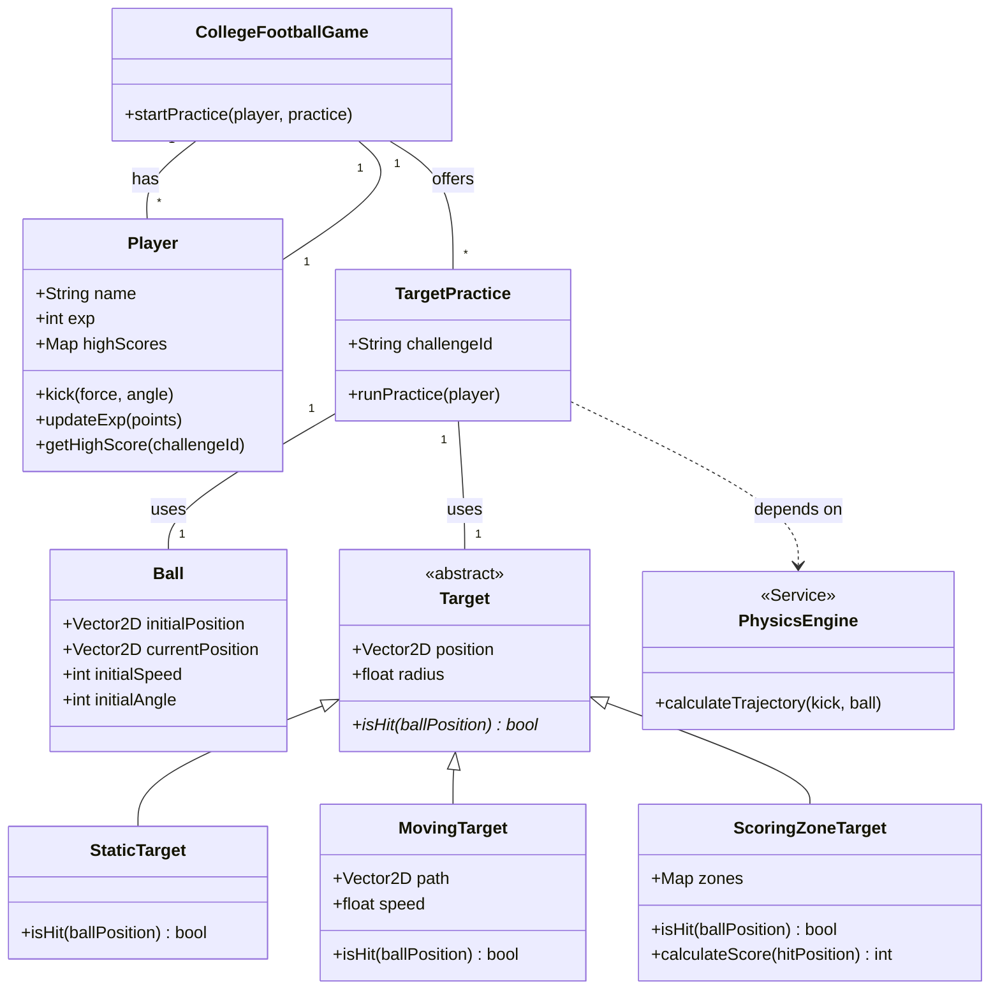

```mermaid

classDiagram
    CollegeFootballGame "1" -- "*" Player : has
    CollegeFootballGame "1" -- "*" TargetPractice : offers
    Player "1" -- "1" CollegeFootballGame
    TargetPractice "1" -- "1" Ball : uses
    TargetPractice "1" -- "1" Target : uses
    TargetPractice ..> PhysicsEngine : depends on
    Target <|-- StaticTarget
    Target <|-- MovingTarget
    Target <|-- ScoringZoneTarget

    class Player{
      +String name
      +int exp
      +Map<String, int> highScores
      +kick(force, angle)
      +updateExp(points)
      +getHighScore(challengeId)
    }

    class CollegeFootballGame{
      +startPractice(player, practice)
    }

    class TargetPractice{
      +String challengeId
      +runPractice(player)
    }

    class Ball{
        +Vector2D initialPosition
        +Vector2D currentPosition
        +int initialSpeed
        +int initialAngle
    }

    class Target{
        <<abstract>>
        +Vector2D position
        +float radius
        +isHit(ballPosition)* bool
    }

    class PhysicsEngine{
        <<Service>>
        +calculateTrajectory(kick, ball)
    }

    class StaticTarget{
      +isHit(ballPosition) bool
    }

    class MovingTarget{
      +Vector2D path
      +float speed
      +isHit(ballPosition) bool
    }

    class ScoringZoneTarget{
      +Map<float, int> zones
      +isHit(ballPosition) bool
      +calculateScore(hitPosition) int
    }


```