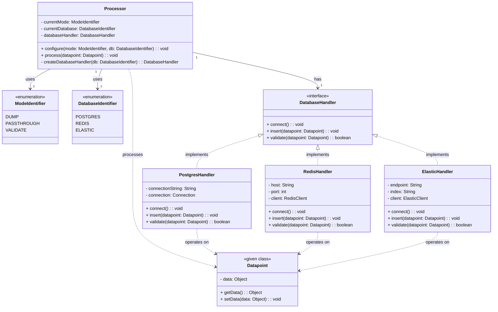

# Walmart Logistics & Retail Data Platform Development

This repository contains my work for the **Walmart Logistics & Retail Data Platform**, developed as part of a simulated real-world engineering project.  
The platform streamlines **shipment prioritization** for logistics operations and provides a **centralized retail database** for Walmart's pet department.  

---

## 🚀 Project Overview

### **1. Logistics Shipment Prioritization Engine**
- Implemented an **optimized heap data structure** in Java for shipment load balancing and priority scheduling.
- Designed for **fast retrieval** of high-priority shipments, reducing delays in logistics workflows.

### **2. Data Processor System Architecture**
- Created a **UML class diagram** for a modular data processor.
- Supported multiple operating modes and seamless database connectivity for scalable data handling.

### **3. Retail Product Database**
- Designed an **Entity Relationship Diagram (ERD)** for Walmart's pet department.
- Modeled manufacturers, products, customers, transactions, and shipments with **full normalization**.

### **4. Automated Data Ingestion**
- Developed a **Python ETL script** to populate an SQLite database from shipping data spreadsheets.
- Enforced **data integrity**, avoided duplicates, and logged import operations.

---

## 🛠️ Tech Stack
- **Languages:** Java, Python
- **Database:** SQLite
- **Design Tools:** UML, ERD
- **Version Control:** Git

---

## Showcase

### UML Class Diagram

### Entity Relationship Diagram

---
