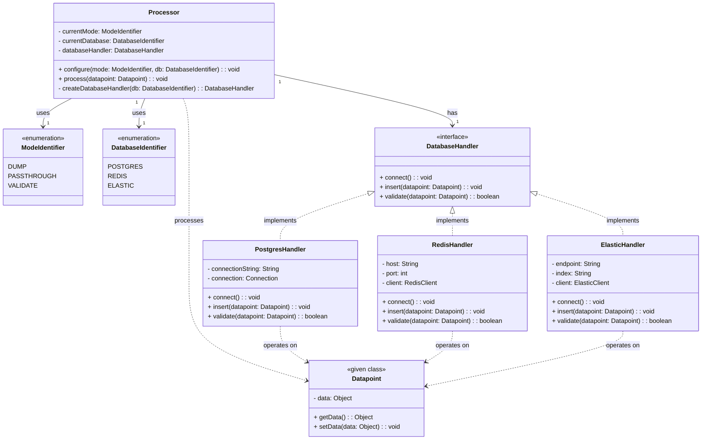

# UML Class Diagram

```mermaid
---
id: 130fc9b4-9bcc-4b2f-abc8-5ca6227ccae4
---
classDiagram
    %% Main relationships
    Processor "1" --> "1" ModeIdentifier : uses
    Processor "1" --> "1" DatabaseIdentifier : uses
    Processor "1" --> "1" DatabaseHandler : has
    Processor ..> Datapoint : processes
    
    %% Database handler relationships
    DatabaseHandler <|.. PostgresHandler : implements
    DatabaseHandler <|.. RedisHandler : implements
    DatabaseHandler <|.. ElasticHandler : implements
    
    %% Database handlers work with datapoints
    PostgresHandler ..> Datapoint : operates on
    RedisHandler ..> Datapoint : operates on
    ElasticHandler ..> Datapoint : operates on

    %% Given classes (provided in requirements)
    class Datapoint {
        <<given class>>
        - data: Object
        + getData(): Object
        + setData(data: Object): void
    }

    class ModeIdentifier {
        <<enumeration>>
        DUMP
        PASSTHROUGH
        VALIDATE
    }

    class DatabaseIdentifier {
        <<enumeration>>
        POSTGRES
        REDIS
        ELASTIC
    }

    %% Main processor class
    class Processor {
        - currentMode: ModeIdentifier
        - currentDatabase: DatabaseIdentifier
        - databaseHandler: DatabaseHandler
        + configure(mode: ModeIdentifier, db: DatabaseIdentifier): void
        + process(datapoint: Datapoint): void
        - createDatabaseHandler(db: DatabaseIdentifier): DatabaseHandler
    }

    %% Database handler interface
    class DatabaseHandler {
        <<interface>>
        + connect(): void
        + insert(datapoint: Datapoint): void
        + validate(datapoint: Datapoint): boolean
    }

    %% Concrete database implementations
    class PostgresHandler {
        - connectionString: String
        - connection: Connection
        + connect(): void
        + insert(datapoint: Datapoint): void
        + validate(datapoint: Datapoint): boolean
    }

    class RedisHandler {
        - host: String
        - port: int
        - client: RedisClient
        + connect(): void
        + insert(datapoint: Datapoint): void
        + validate(datapoint: Datapoint): boolean
    }

    class ElasticHandler {
        - endpoint: String
        - index: String
        - client: ElasticClient
        + connect(): void
        + insert(datapoint: Datapoint): void
        + validate(datapoint: Datapoint): boolean
    }
```